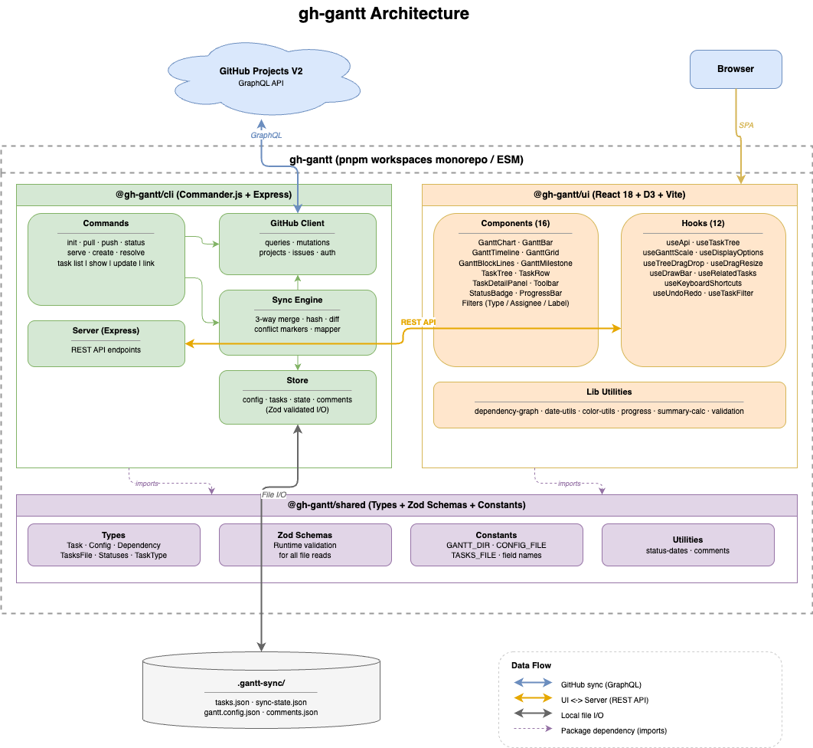

# gh-gantt

A CLI tool that bi-directionally syncs with GitHub Projects (V2) and visualizes tasks as a Gantt chart.

Visualize task hierarchies, dependencies, and aggregated progress — all manageable from the command line. Designed for seamless integration with AI agents like Claude Code.

## Why gh-gantt?

GitHub Projects (V2) lacks three things that gh-gantt fills in:

1. **Project structure visualization** — Display epic → feature → task hierarchies, dependencies, and aggregated progress on a Gantt chart
2. **CLI-driven operations** — Both AI agents and humans manage tasks with the same commands
3. **Local-first data** — Cache project data in `.gantt-sync/` so context is instantly available across sessions without API calls

## Installation

Install from npm using whichever package manager you prefer:

```bash
npm install -g gh-gantt
# or
pnpm add -g gh-gantt
# or
yarn global add gh-gantt
# or
bun add -g gh-gantt
```

This is the recommended path for end users — including AI agents running on Claude Code (web/cloud) where the CLI must be installable without cloning the repository.

### From source (for contributors)

```bash
git clone https://github.com/stanah/gh-gantt.git
cd gh-gantt
pnpm install
pnpm build
pnpm --filter gh-gantt exec pnpm link --global
```

### Prerequisites

- Node.js >= 24
- GitHub CLI (`gh`) installed and authenticated via `gh auth login`

## Usage

### Initialize

```bash
# Initialize from a GitHub Project (V2)
gh-gantt init --owner <owner> --repo <repo> --project <project_number>
```

### Sync

```bash
gh-gantt pull     # Pull latest data from GitHub
gh-gantt push     # Push local changes to GitHub
gh-gantt status   # Show sync status
```

### Task Management

```bash
gh-gantt list                         # List tasks
gh-gantt show <id>                    # Show task details
gh-gantt update <id>                  # Update a task
gh-gantt link <id>                    # Manage dependencies and parent relationships
gh-gantt create                       # Create a new draft task locally
```

### Conflict Resolution

```bash
gh-gantt conflicts                    # List unresolved conflicts
gh-gantt resolve [issue]              # Resolve conflicts
```

### Gantt Chart UI

```bash
gh-gantt serve                        # Start UI server (http://localhost:3000)
gh-gantt serve --port 8080            # Specify port
gh-gantt serve --api-only             # API server only
```

## Architecture



A pnpm workspaces monorepo with 3 packages:

| Package            | Role                                                                                         |
| ------------------ | -------------------------------------------------------------------------------------------- |
| `@gh-gantt/shared` | Type definitions & Zod schemas (bundled into `gh-gantt` at publish time; not published)      |
| `gh-gantt`         | CLI (Commander) + REST API (Express) + sync engine + GitHub GraphQL client; published to npm |
| `@gh-gantt/ui`     | React SPA (Vite + D3); built output is bundled into `gh-gantt` so `gh-gantt serve` works     |

### Design Principles

- **CLI-first** — All operations are complete from the CLI. The web UI is for visualization
- **Local-first** — Data is stored locally. The API is used only for syncing
- **Git-like sync model** — Familiar pull / push / conflict resolve workflow
- **Coexists with GitHub Projects** — Complements existing workflows rather than replacing them

## Development

```bash
pnpm install          # Install dependencies
pnpm build            # Build all packages
pnpm dev              # Development mode (CLI watch + UI dev server)
pnpm test             # Run all tests
pnpm lint             # Lint + format check
pnpm typecheck        # Type check
```

## License

MIT
