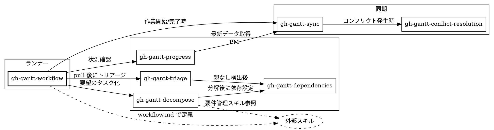

# gh-gantt スキル再設計

## 背景

gh-gantt の `skills/` 配下のスキルは、gh-gantt CLI を使う任意のプロジェクトで適用できる汎用的な知識を提供する。

### 現状の問題

1. `gh-gantt-workflow` が 1 つのスキルに全責務を詰め込んでいる
2. プロセスの強制力がない（HARD-GATE、Red Flags なし）
3. タスク完了後の状態更新ステップが漏れやすい
4. PM 的な視点（トリアージ、依存関係管理、進捗追跡）が欠如
5. プロジェクト固有のルール（TDD、ドキュメント更新等）を組み込む拡張性がない
6. 要望をそのまま Issue 化すると粒度のばらつき・重複・矛盾が生じる

### 設計方針

- **superpowers** のパターン: HARD-GATE、プロセスフロー図、Red Flags、スキルチェーン、evidence-based verification
- **everything-claude-code** のパターン: フェーズベースワークフロー、検証ゲート、ルールとプロセスの分離
- 各スキルが 1 つの責務を持ち、スキル間はチェーンで接続
- プロジェクト固有のワークフローはワークフロー定義ファイルで設定

## ワークフロー定義ファイル

**配置場所:** `.gantt-sync/workflow.md`

プロジェクトごとの開発ワークフローを定義するファイル。gh-gantt 固有のフロー（pull/push/タスク管理）と、プロジェクト固有のフロー（TDD、ドキュメント更新、使用スキル等）を 1 箇所で管理する。

このファイルはプロジェクト設定であり、直接編集してよい（同期データとは異なる）。

**解釈方式:** エージェントへの自然言語指示ファイルとして扱う。構造化パースは行わず、エージェントがコンテキストとして読み取り、指定されたスキルやルールに従う。

```markdown
# 開発ワークフロー

## 作業開始

- gh-gantt pull → タスク確認 → タスク選択 → ブランチ作成

## 開発

- TDD で進める → `superpowers:test-driven-development` スキルを使用
- セキュリティに関わる変更 → `everything-claude-code:security-review` を使用

## タスク化

- 要件管理: `superpowers:brainstorming` → `superpowers:writing-plans` を使用
- タスク分解時は上記で作成した spec を参照する

## 完了

- pnpm test && pnpm typecheck && pnpm build
- CHANGELOG.md を更新する
- gh-gantt task update → gh-gantt push
```

ワークフロー定義ファイルが存在しない場合は、各スキル内蔵のデフォルトフローで動作する。

## スキル構成

### 一覧

| スキル                         | 種別     | 責務                                                                     |
| ------------------------------ | -------- | ------------------------------------------------------------------------ |
| `gh-gantt-workflow`            | ランナー | ワークフロー定義ファイルを読んでフロー実行                               |
| `gh-gantt-sync`                | 同期     | pull/push の規律、コンフリクト解決へのルーティング、タスク状態更新の検証 |
| `gh-gantt-decompose`           | PM       | 要望の調査・分解・Issue 化                                               |
| `gh-gantt-triage`              | PM       | 既存タスクの衛生管理                                                     |
| `gh-gantt-dependencies`        | PM       | 依存関係の設定・検証                                                     |
| `gh-gantt-progress`            | PM       | 進捗追跡・リスク評価                                                     |
| `gh-gantt-conflict-resolution` | 同期     | (既存) コンフリクト解決                                                  |

注: 旧設計にあった `gh-gantt-issue-sync` は `gh-gantt-sync` の push フローに統合。Issue body/title の整合性確認は push 前の検証ステップとして扱う。

### チェーン関係



### スキルチェーンの呼び出し規約

スキル内で他スキルを呼び出す箇所は以下の形式で明示する:

```markdown
**REQUIRED:** `gh-gantt-sync` スキルを invoke する。
```

任意の呼び出しは:

```markdown
**OPTIONAL:** `gh-gantt-triage` でタスクの衛生状態を確認する。
```

### 各スキルの設計

---

#### `gh-gantt-workflow`

**トリガー:** 開発サイクルを一から回す場合。「作業を始めたい」「次に何をすべき？」「開発サイクルを回して」

**トリガーではない:** 特定の要望をタスク化する場合（→ `gh-gantt-decompose`）、進捗確認のみ（→ `gh-gantt-progress`）、同期のみ（→ `gh-gantt-sync`）

**責務:**

- `.gantt-sync/workflow.md` が存在すれば読み、プロジェクトのコンテキストとして参照する
- 開発サイクルの各フェーズで適切なスキルを invoke する
- ワークフロー定義がない場合はデフォルトフローを適用する

**デフォルトフロー:**

1. **REQUIRED:** `gh-gantt-sync`（pull）を invoke
2. **OPTIONAL:** `gh-gantt-triage` でタスクの衛生状態を確認
3. タスク確認・選択
4. ブランチ作成
5. 開発 & 検証（workflow.md に指定があればそのスキルを使用）
6. コミット & PR
7. **REQUIRED:** `gh-gantt-sync`（タスク更新 + push）を invoke

<HARD-GATE>
ステップ 1（sync pull）の完了を evidence で確認するまで、ステップ 3 以降に進んではならない。

チェック条件: `gh-gantt status` を実行し、出力を確認する。
失敗時: pull を実行し、成功の出力を evidence として提示する。
Evidence: `gh-gantt status` または `gh-gantt pull` の出力をそのまま提示する。
</HARD-GATE>

**Red Flags:**

| やりがちなこと                 | 問題                                         |
| ------------------------------ | -------------------------------------------- |
| pull せずに作業開始            | 古いデータで作業、コンフリクトリスク         |
| タスク選択をスキップ           | 何を解決しているか不明確、Issue と紐づかない |
| 検証せずにコミット             | 壊れたコードを push してしまう               |
| コミット後にタスク更新を忘れる | GitHub と乖離、進捗が見えない                |

| 言い訳                         | 現実                                                  |
| ------------------------------ | ----------------------------------------------------- |
| 「さっき pull したばかり」     | status の出力を確認すること。記憶は evidence ではない |
| 「小さい変更だからタスク不要」 | 追跡されない変更はプロジェクトの盲点になる            |
| 「後で push する」             | 後では来ない。コミットと push はセットで行う          |

---

#### `gh-gantt-sync`

**トリガー:** 「同期して」「pull して」「push して」、および他スキルからの REQUIRED チェーン

**責務:**

- pull/push の実行と結果の検証
- コンフリクト検出時に `gh-gantt-conflict-resolution` へルーティング
- push 前にタスク状態の更新漏れと Issue 内容の整合性を確認

<HARD-GATE>
コンフリクトがある状態で作業を開始してはならない。

チェック条件: `gh-gantt conflicts` を実行し、コンフリクトが 0 件であること。
失敗時: `gh-gantt-conflict-resolution` スキルを invoke する。解決完了まで他の作業に進まない。
Evidence: `gh-gantt conflicts` の出力が "No conflicts." であること。
</HARD-GATE>

**プロセス（pull）:**

1. `gh-gantt pull` 実行
2. `gh-gantt status` で状態確認 — evidence として出力を提示
3. コンフリクトがあれば **REQUIRED:** `gh-gantt-conflict-resolution` を invoke
4. `gh-gantt conflicts` で "No conflicts." を確認 — evidence として出力を提示

**プロセス（push）:**

1. タスク状態の更新漏れがないか確認（作業対象タスクが open のままではないか）
2. Issue body/title が実装内容と乖離していないか確認（大きな仕様変更があれば更新を促す）
3. `gh-gantt push` 実行
4. `gh-gantt status` で未 push 変更がないことを検証 — evidence として出力を提示

**Red Flags:**

| やりがちなこと        | 問題                                 |
| --------------------- | ------------------------------------ |
| pull せずに作業開始   | 古いデータで作業、コンフリクトリスク |
| タスク更新せずに push | GitHub 上で進捗が見えない            |
| コンフリクトを放置    | push も pull もできなくなる          |
| Issue body を放置     | 実装と要件の乖離が蓄積する           |

---

#### `gh-gantt-decompose`

**トリガー:** 特定の要望をタスク化する場合。「X を実装して」「Y を追加して」「Z を直して」「タスク化して」「Issue を作って」

**トリガーではない:** 開発サイクル全体を回す場合（→ `gh-gantt-workflow`）

**責務:**

- 要望を受けて、そのまま Issue 化せず、まず調査・分析する
- 外部の要件管理スキルとの接続（workflow.md で定義されている場合）

<HARD-GATE>
既存タスクとの重複・矛盾チェックなしに Issue を作成してはならない。

チェック条件: `gh-gantt task list` で既存タスクを調査し、重複・類似タスクがないことを確認する。
失敗時: 重複・類似タスクがある場合、ユーザーに提示して方針を確認する（既存タスクの更新 or 新規作成 or 中止）。
Evidence: `gh-gantt task list` の出力と、重複なしの判断根拠を提示する。
</HARD-GATE>

**プロセス:**

1. **要件の参照元を確認** — workflow.md に要件管理スキルが指定されていれば参照を促す
2. **既存タスク調査** — `gh-gantt task list` で重複・類似タスクを検索 — evidence として結果を提示
3. **矛盾チェック** — 既存タスクと矛盾する要望ではないか確認
4. **粒度の判断** — エピック / フィーチャー / タスクのどのレベルか。ユーザーに提示して確認
5. **分解** — 大きすぎる要望は適切な粒度に分割
6. **Issue 作成** — 各タスクの body に要件を記述。`gh-gantt create` で作成
7. **作成確認** — `gh-gantt task show <number>` で作成内容を確認 — evidence として出力を提示
8. **構造化** — `gh-gantt task link --set-parent` で親子関係を設定。**OPTIONAL:** `gh-gantt-dependencies` で依存関係を設定
9. **同期** — **REQUIRED:** `gh-gantt-sync`（push）を invoke

**Red Flags:**

| やりがちなこと                   | 問題                             |
| -------------------------------- | -------------------------------- |
| 要望をそのまま 1 Issue にする    | 粒度がばらける                   |
| 既存タスクを調べない             | 重複・矛盾が生じる               |
| body を空にする                  | 要件が不明確なタスクが増える     |
| 複数タスクの親子関係を設定しない | 構造が見えない、進捗集計できない |

| 言い訳                               | 現実                                                          |
| ------------------------------------ | ------------------------------------------------------------- |
| 「タスクリストが長くて探すのが大変」 | `gh-gantt task list` で検索できる。手間を惜しむと重複が増える |
| 「後で整理する」                     | 後では来ない。作成時に構造化する                              |
| 「小さいから body は不要」           | 3 ヶ月後の自分は覚えていない                                  |

---

#### `gh-gantt-triage`

**トリガー:** 「タスクを整理して」「バックログを整理」、および `gh-gantt-workflow` の pull 後ステップからの OPTIONAL チェーン

**責務:**

- 既存タスクの健康状態を検査し、問題を修正する

**検査項目:**

| 検査                           | 検出方法                                 | 対処                                       |
| ------------------------------ | ---------------------------------------- | ------------------------------------------ |
| 親なしタスク                   | `parent: null` かつ type が task/feature | 適切なエピック/フィーチャーの下に配置      |
| 日程なしタスク                 | `start_date` と `end_date` が両方 null   | 日程を設定、または意図的なバックログか確認 |
| body 空のエピック/フィーチャー | `body: null`                             | 要件の記述を促す                           |
| 型が不適切                     | task に子タスクがある等                  | 型の変更を提案                             |
| 閉じ忘れ                       | 実装済みだが open のまま                 | closed への更新を提案                      |

**プロセス:**

1. **REQUIRED:** `gh-gantt-sync`（pull）を invoke して最新データを取得
2. `gh-gantt task list --json` で全タスク取得（`parent`, `body` 等のフィールドはデフォルト出力に含まれないため `--json` を使用）
3. 上記の検査を実行
4. 問題を優先度順（親なし > 閉じ忘れ > body 空 > 日程なし > 型不適切）に一覧で提示
5. 5 件以下: 個別にユーザー確認。6 件以上: カテゴリごとにまとめて方針を確認
6. **OPTIONAL:** 親なしタスクが見つかった場合、`gh-gantt-dependencies` で依存関係も確認

---

#### `gh-gantt-dependencies`

**トリガー:** 「依存関係を設定して」「ブロッカーは？」「クリティカルパスは？」、および `gh-gantt-decompose`/`gh-gantt-triage` からのチェーン

**責務:**

- タスク間の依存関係（blocked_by）の設定・検証
- 問題のある依存関係の検出

**検査項目:**

- 循環依存の検出
- closed タスクへの依存（解消済みだが残っている）
- ブロッカー分析（何がブロックされているか、ブロックチェーンの深さ）
- クリティカルパスの特定

**プロセス:**

1. `gh-gantt task list --json` で全タスクと依存関係を取得（`blocked_by` はデフォルト出力に含まれないため `--json` を使用）
2. 問題を検出・報告 — evidence として具体的なタスク ID と関係を提示
3. ユーザーに修正方針を確認
4. `gh-gantt task link` で設定・修正を実行
5. 修正後、`gh-gantt task show <number>` で結果を確認 — evidence として出力を提示

---

#### `gh-gantt-progress`

**トリガー:** 「進捗は？」「プロジェクトの状態は？」「遅れてるタスクは？」「次に何をすべき？」

**責務:**

- プロジェクト全体の進捗を評価し、アクションを提案する

**分析項目:**

- エピックごとの進捗率（子タスクの完了数/全体数）
- 遅延タスクの検出（end_date が過去なのに open）
- リスク評価（期限が近いが未着手のタスク）
- ブロッカーによる停滞
- 次に着手すべきタスクの提案（期限・依存関係・優先度を考慮）

**プロセス:**

1. **REQUIRED:** `gh-gantt-sync`（pull）を invoke して最新データを取得
2. `gh-gantt task list --json` + `gh-gantt status` で全体像把握（`blocked_by`, `priority` 等のフィールドはデフォルト出力に含まれないため `--json` を使用）
3. 分析・レポート
4. アクションの提案（タスク着手、日程調整、ブロッカー解消等）

---

#### `gh-gantt-conflict-resolution`（既存）

変更なし。現行のままで十分。

## スキル設計規約

### トークン効率

各スキルの SKILL.md は簡潔に保つ。目安:

- 頻繁にロードされるスキル（workflow, sync）: 200 words 以下
- その他のスキル: 500 words 以下
- コマンドリファレンス等の重い情報は `references/` に分離する

### evidence-based verification

各スキルのプロセスで CLI コマンドを実行した際は、その出力を evidence として提示する。「実行した」という報告ではなく、出力そのものを示す。

### ファイル命名規約

スキルファイルは `SKILL.md`（大文字）に統一する。

## 実装計画

### Phase 1: 基盤

1. CLAUDE.md のルール変更（済み）
2. `conflict-resolution/SKILL.md` → `gh-gantt-conflict-resolution/SKILL.md` リネーム
3. `gh-gantt-workflow` の実装
4. `gh-gantt-sync` の実装

### Phase 2: PM スキル

5. `gh-gantt-decompose`
6. `gh-gantt-triage`
7. `gh-gantt-dependencies`

### Phase 3: 追跡

8. `gh-gantt-progress`

### Phase 4: 検証

9. `.gantt-sync/workflow.md` のサンプル作成（gh-gantt プロジェクト自体用）
10. gh-gantt プロジェクトで全スキルを使ってセルフテスト
